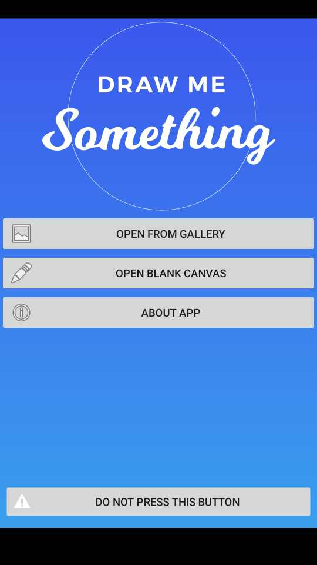

[](https://travis-ci.org/testfairy/draw-me-a-fairy)

# Draw Me A Fairy

*Draw Me A Fairy* is a sample application using TestFairy SDK. 



With this sample application, we show how to use features of the platform, including:

- Initializing the SDK ([src](https://github.com/testfairy/draw-me-a-fairy/blob/master/app/src/main/java/com/testfairy/samples/drawmefairy/MyApplication.java#L58))
- Recording videos of app use
- Identifying users, for future searches ([src](https://github.com/testfairy/draw-me-a-fairy/blob/master/app/src/main/java/com/testfairy/samples/drawmefairy/MyApplication.java#L57))
- Capturing logs, and sending them to TestFairy
- Remote Logging (logs not written to logcat, but are sent to TestFairy) ([src](https://github.com/testfairy/draw-me-a-fairy/blob/master/app/src/main/java/com/testfairy/samples/drawmefairy/MyApplication.java#L60))
- Adding events after specific user interactions ([src](https://github.com/testfairy/draw-me-a-fairy/blob/master/app/src/main/java/com/testfairy/samples/drawmefairy/DrawingActivity.java#L245))
- Attaching files for future inspections ([src](https://github.com/testfairy/draw-me-a-fairy/blob/master/app/src/main/java/com/testfairy/samples/drawmefairy/DrawingPanel.java#L123))

```
NOTE: 

To run this app on your own device, please clone and open the project using Android Studio. Then open MyApplication.java file, and change the APP_TOKEN to your value. See https://app.testfairy.com/settings/ for more information.
```
